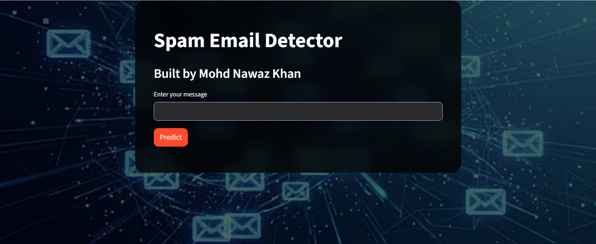
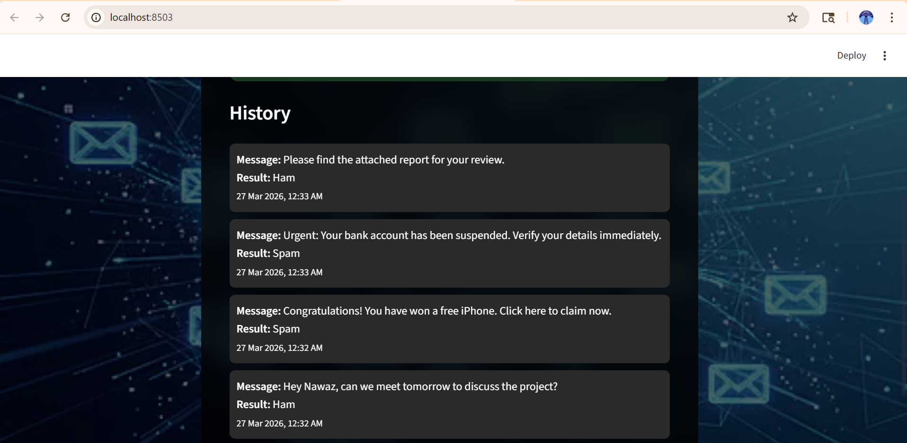

## Spam Email Classification System

This project is a Machine Learning-based Spam Email Classification system developed during the AICTE Internship – AI: Transformative Learning with TechSaksham (a joint CSR initiative of Microsoft & SAP, implemented by Edunet Foundation).

The system classifies email messages as:

- Spam (Unwanted / Fraudulent)  
- Ham (Legitimate Email)  

---

## Live Demo

https://spam-email-classifier-nawaz.streamlit.app/

---

## Problem Statement

Email spam is a major issue that affects productivity and cybersecurity.  
The goal of this project is to build a spam detection system using NLP and Machine Learning techniques to automatically classify emails.

---

Features
Real-time spam detection
Displays prediction confidence score
Interactive UI using Streamlit
NLP-based machine learning model
Deployed on Streamlit Cloud

---
## Tech Stack
Python
Streamlit
Scikit-learn
Pandas
NumPy
gTTS

---
## Project Structure
Spam-Email-Classification/
│── __pycache__/
│── assets/
│── background.jpg
│── README.md
│── requirements.txt
│── Spam Email.ipynb
│── Spam_Email_Detector.py
│── spam.csv
│── spam.pkl
│── vectorizer.pkl
│── train_model.py

---
## How to Run Locally
git clone https://github.com/nawaztech24/Spam-Email-Classification.git
cd Spam-Email-Classification
pip install -r requirements.txt
streamlit run Spam_Email_Detector.py

---
## Screenshots
### Home Page

### Spam Prediction

### Ham Prediction

### History Page

--- 

## Model Details
Algorithm: Naive Bayes
Text preprocessing using NLP techniques
Trained on labeled dataset (spam.csv)
Model saved using pickle (spam.pkl, vectorizer.pkl)

---

## Author

Mohd Nawaz Khan

---

## Future Improvements

Improve model accuracy with advanced algorithms
Add email API integration
Enhance UI/UX design
Add user authentication